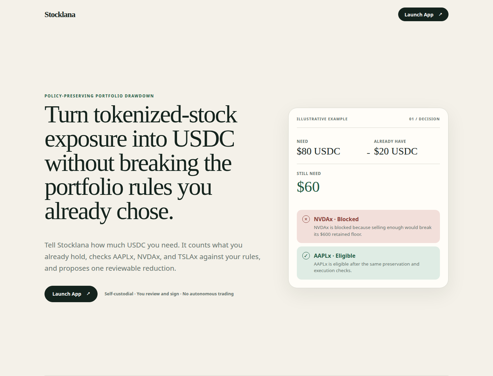

# DrawRail

**Draw liquidity from your tokenized-stock portfolio within the rules you set.**

DrawRail turns tokenized-stock exposure into USDC without breaking your portfolio rules.

Illustrative request:

- Need 80 USDC.
- Already have 20 USDC.
- Need 60 more.
- NVDAx is rejected because selling enough would violate the user's retained-exposure floor.
- AAPLx is eligible under the same preservation and execution checks.
- The user reviews the proposed drawdown and, in the later transaction milestone, signs it explicitly.



### Why this exists

A manual swap asks which token to sell. That is the wrong first question for someone who needs cash
but wants to preserve chosen stock exposure. DrawRail starts with the USDC need, counts existing USDC
first, and evaluates supported positions against deterministic retained-exposure and execution rules.

It is not an investment advisor or trading bot. It applies rules the user already chose and explains
why each position is selected, rejected, unavailable, or ranked lower.

### How it works

```text
USDC need → portfolio policy → xStock evaluation → Jupiter quote → review → wallet signature → settlement evidence
```

The current application stops at the read-only review. Wallet signing and settlement are shown in the
product flow but are not implemented or simulated yet.

### Why Solana

- **xStocks** provide tokenized-stock exposure in a self-custody wallet.
- **Token-2022 Scaled UI Amount** means displayed economic units can differ from raw transaction units;
  DrawRail reads the live multiplier and hard-blocks its activation window.
- **Jupiter Swap V2** supplies current ExactIn xStock → USDC liquidity and conservative minimum output.
- **Wallet signing** keeps authorization with the user rather than an autonomous service.
- **RPC settlement evidence** will prove the actual wallet debit and credit in the transaction milestone.

### Current status

Completed:

- closed registry for AAPLx, NVDAx, TSLAx, and USDC;
- aggregate balance reads across multiple token accounts;
- live mainnet Token-2022 multiplier parsing and official conversion-parity tests;
- inclusive ±15-minute multiplier activation hard block;
- live quote-only Jupiter Swap V2 evaluation;
- deterministic retained-floor policy engine and candidate ranking;
- public landing page, read-only portfolio, request, decision, and review surfaces;
- live mainnet read-only actionable and blocked decision evidence; and
- authenticated Pyth Pro validation, exact freshness/confidence/publisher/divergence rules, and fail-closed policy/UI infrastructure.

Not yet implemented:

- injected wallet connection and wallet signing;
- final Jupiter transaction construction or `/execute`;
- funded transaction submission and RPC settlement reconciliation; and
- optional Pyth reference protection in the live product: the configured trial entitlement reaches only the TSLA equity reference, not all six required feeds, and xStock unit alignment remains unverified.

No funded mainnet transaction has been performed by this application.

### Supported assets

- AAPLx
- NVDAx
- TSLAx
- USDC

### Safety model

- Self-custodial: DrawRail never accepts or stores a wallet private key.
- User-authorized: the planned financial action requires an explicit wallet signature.
- Closed assets: no hidden issuer or mint substitution.
- Deterministic: no AI trading, autonomous portfolio management, or investment recommendation.
- Multiplier-safe: activation-window violations hard-block rather than warn.
- Amount-correct: raw integers and displayed Token-2022 amounts remain separate typed concepts.
- Conservative: retained floors use the exact remaining-position quote's minimum output.

### Run locally

Requirements: Node.js 20.9 or newer.

```bash
cp .env.example .env.local
npm install
npm run dev
```

Verification:

```bash
npm test
npm run typecheck
npm run lint
npm run build
npm run validate:mainnet -- <wallet-public-key>
npm run validate:pyth
```

`SOLANA_RPC_URL` and `JUPITER_API_KEY` are server-side only. The public RPC and currently reachable
keyless quote path are suitable for limited read-only checks, but reliable deployment requires
production credentials. Never add a wallet keypair, seed phrase, private key, or real secret to this repository.

`PYTH_PRO_API_KEY` is also server-only. `validate:pyth` prints only sanitized feed metadata and observations. Reference protection stays unavailable unless all six feeds are entitled and representation units are verified; the core non-Pyth drawdown remains usable.

### Hackathon

Built for the Solana Foundation Stocklana hackathon.
