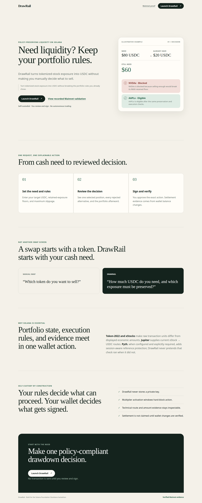

# DrawRail

**DrawRail turns tokenized-stock exposure into USDC without breaking the portfolio rules you already chose.**

[Live app](https://drawrail.vercel.app) · [Recorded Mainnet proof](https://drawrail.vercel.app/validation) · [Transaction on Solscan](https://solscan.io/tx/4fk7YBSP2pjGoxbW91CHZZaU9dStZ5y2M73j3UTbdYefk5ESjTmnYvwQx2gwnEAnctorjzX58KASAvx2PULdM2uN)



```text
Need 80 USDC
− Already have 20 USDC
= Need 60 more
→ NVDAx rejected because the sale would violate its retained floor
→ AAPLx eligible
→ User reviews and explicitly signs one exact drawdown
```

DrawRail completed one low-value Mainnet end-to-end AAPLx → USDC validation. The public deployment remains safely configured as **Mainnet read only** with funded execution disabled.

## Why this exists

A normal swap asks, “What token do you want to sell?” That makes the user manually translate a cash need into a portfolio decision.

DrawRail starts with, “How much liquidity do you need, and what exposure do you refuse to break?” It counts existing USDC first, evaluates supported stock positions against deterministic rules, explains the selected and rejected positions, and binds the review to the exact transaction the wallet signs.

DrawRail is not an investment advisor, trading bot, autonomous agent, or generic transaction firewall.

## How it works

```text
USDC need
→ existing USDC
→ portfolio policy
→ xStock evaluation
→ wallet-bound Jupiter order
→ exact transaction review
→ explicit wallet signature
→ RPC settlement evidence
```

The V1 policy set is intentionally small: retained-exposure floors, maximum slippage, multiplier activation-window blocking, raw/displayed Token-2022 correctness, and optional TSLAx reference protection.

## Why Solana

- **xStocks** place tokenized-stock exposure in the same self-custody wallet as USDC.
- **Token-2022 Scaled UI Amount** means economic/displayed amounts can differ from raw transaction amounts. DrawRail reads the live multiplier, verifies official conversion parity, and blocks around pending activation.
- **Jupiter Swap V2** supplies live executable xStock → USDC liquidity, wallet-bound v0 transactions, minimum output, routing, and fee evidence.
- **Wallet Standard** lets the owner explicitly sign the exact reviewed message without giving DrawRail custody.
- **Solana RPC** provides the final settlement authority through connected-wallet token balance deltas.

## Pyth reference protection

DrawRail implements authenticated, opt-in reference protection for **TSLAx only**:

- Pyth Pro symbol: `Equity.US.TSLA/USD`;
- resolved feed ID: `1435`;
- fresh `feedUpdateTimestamp`, session, confidence, and publisher checks;
- comparison against the multiplier-correct executable TSLAx price derived from the exact Jupiter candidate quote; and
- a hard eligibility block when divergence exceeds the user’s threshold.

In recorded live evidence, the same TSLAx candidate passed at a 100 bps limit and was blocked at 17 bps. AAPLx and NVDAx reference protection remain unavailable under the current trial entitlement; DrawRail does not represent them as protected.

## Mainnet validation

DrawRail completed a low-value Mainnet end-to-end validation—not production-scale usage.

| Evidence | Value |
|---|---:|
| Asset / router | AAPLx / Metis |
| Raw AAPLx debit | `149435` |
| Reviewed expected / minimum | `502515 / 500002` raw USDC |
| Actual RPC USDC credit | `502515` raw USDC |
| Gross route output / output fee | `503018 / 503` raw USDC |
| Jupiter status / code | `Success / 0` |
| Solana slot | `450156253` |
| Retry behavior | No retry occurred |

Transaction: [`4fk7…M2uN`](https://solscan.io/tx/4fk7YBSP2pjGoxbW91CHZZaU9dStZ5y2M73j3UTbdYefk5ESjTmnYvwQx2gwnEAnctorjzX58KASAvx2PULdM2uN)

RPC-observed wallet deltas remain authoritative. Jupiter’s `totalInputAmount` and `totalOutputAmount` reconcile wallet amounts; route-result fields are separately reconciled with fee-mint semantics.

## Safety model

- Self-custodial: DrawRail never accepts or stores a wallet private key.
- User-authorized: every financial action requires an explicit wallet signature.
- Exact-message binding: the server verifies the wallet signed the reviewed message bytes.
- Closed registry: AAPLx, NVDAx, TSLAx, and USDC only.
- Fail-closed state: malformed mint data, activation windows, stale protection data, expired orders, or unprovable transaction properties block progression.
- No automatic financial retry: unknown submission state is investigated against the same signature/request.
- RPC settlement authority: success requires reconciled connected-wallet balance changes.
- Public safe mode: production defaults to `FUNDED_EXECUTION_ENABLED=false` and `mainnet-read-only`.

## Supported assets

- AAPLx
- NVDAx
- TSLAx
- USDC

## Architecture

DrawRail is one Next.js/TypeScript application:

- browser: Wallet Standard connection, policy input, decision/review/receipt UI;
- server routes: live portfolio normalization, deterministic policy evaluation, Pyth/Jupiter calls, unsigned transaction validation, receipt binding, and controlled execution;
- domain layer: branded bigint/fixed-precision amounts, Token-2022 conversion, policy reason codes, expiry, Pyth, and reconciliation rules;
- external authorities: Solana RPC, Jupiter Swap V2, and authenticated Pyth Pro.

No custom Solana program is required. Existing wallet, Token-2022, and Jupiter programs enforce ownership and movement; DrawRail binds its off-chain policy review to the exact signed transaction.

## Current limitations

- Public funded execution is deliberately disabled.
- AAPLx and NVDAx Pyth reference protection is unavailable under the current trial entitlement.
- The replay guard is process-local; durable atomic idempotency is required before multi-instance funded production use.
- Supported assets and policies are intentionally narrow.
- One Mainnet transaction proves the path, not operating scale or a security audit.

## Run locally

Requirements: Node.js 20.9 or newer.

```bash
cp .env.example .env.local
npm install
npm run dev
```

Verification:

```bash
npm test
npm run typecheck
npm run lint
npm run build
npm run validate:mainnet -- <wallet-public-key>
npm run validate:pyth -- <wallet-public-key>
```

See [DEPLOYMENT.md](DEPLOYMENT.md) for the exact Vercel environment list and safe production defaults. API keys, RPC credentials, and receipt secrets are server-only. Never put a keypair, seed phrase, private key, or real secret in this repository.

## Hackathon

Built for the Solana Foundation Stocklana hackathon.
